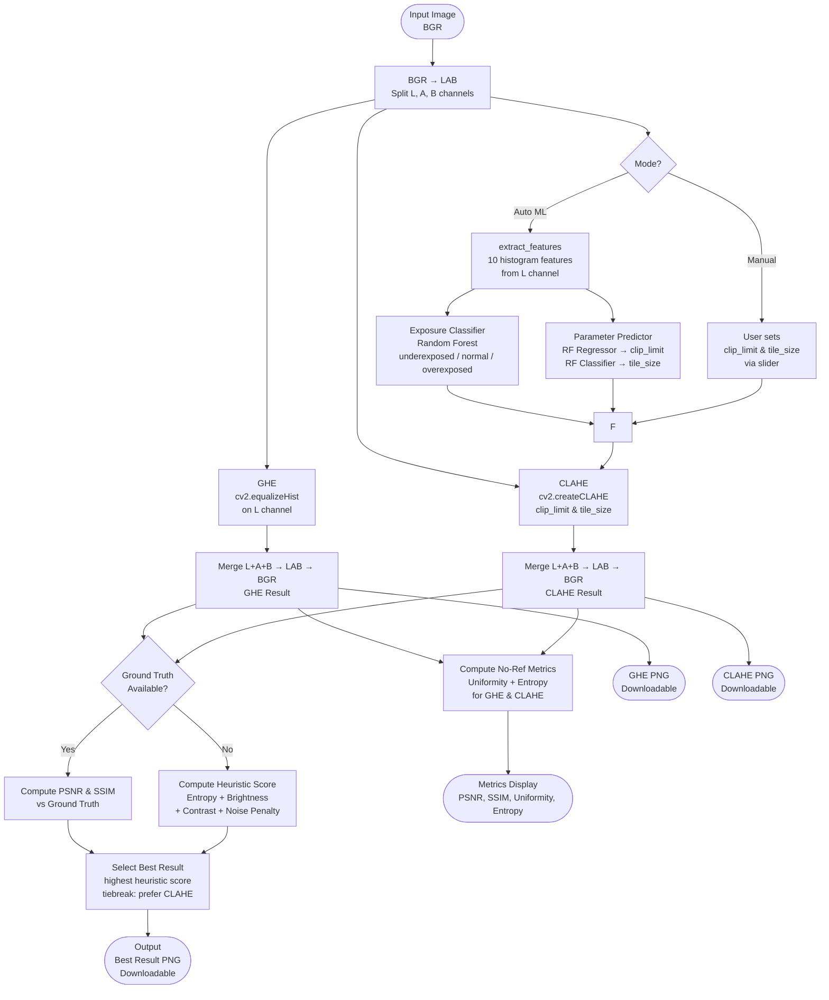

# Automated Contrast Correction System for Under-Exposed and Over-Exposed Photography Using Optimized Histogram Equalization

**Course:** COMP7116001 — Computer Vision | Binus University | Semester Even 2025/2026  
**Lecturer:** Fiqri Ramadhan Tambunan, S.Kom., M.Kom  

**Team 2:**  
Ahmad Daffa Hidayatullah (2802486980) · Andrey Apriliady (2802493752) · Ezra Mayurga (2802481626)  
Jason Firenze Trianto (280248447) · Keanu Stadeva (2802488185) · Rafifdiya (2802484483)

---

## Abstract

Images captured in suboptimal lighting conditions frequently exhibit low contrast, where fine details are obscured in shadow regions or washed out in overexposed highlights. While Global Histogram Equalization (GHE) is a classical solution, it suffers from over-amplification of noise and unnatural brightness shifts due to its global, non-adaptive nature. This paper presents an automated contrast correction system that combines Contrast Limited Adaptive Histogram Equalization (CLAHE) with machine learning to address both under-exposure and over-exposure. All enhancement is performed on the Lightness (L) channel of the CIELAB color space, preserving chromatic fidelity. The system integrates two machine learning modules trained on the LOL (Low-Light) dataset: an Exposure Classifier that identifies the exposure condition of an input image, and a Parameter Predictor that recommends optimal CLAHE parameters. A systematic grid search over 12 CLAHE parameter combinations across 485 training images establishes that clip limit = 4.0 with tile size = 4×4 yields the highest mean SSIM of 0.4519, outperforming GHE (SSIM = 0.4431). The exposure classifier achieves 96.28% cross-validation accuracy (±1.61%), and the parameter predictor achieves a clip limit MAE of 0.0837 and tile size accuracy of 99.59%. Additionally, no-reference evaluation metrics — Histogram Uniformity and Entropy — are introduced to assess enhancement quality without ground truth images. The complete system is deployed as an interactive web application using Streamlit, providing side-by-side comparison, automatic best-result selection, and downloadable outputs.

---

## 1. Introduction

Digital photography has become pervasive in modern life, with billions of images captured daily through smartphones, surveillance systems, medical devices, and autonomous vehicles. However, real-world imaging conditions frequently deviate from ideal exposure settings. Scenes with insufficient lighting — such as night photography, indoor environments, or backlit subjects — produce under-exposed images where shadow regions lack detail. Conversely, intense illumination conditions — such as direct sunlight or camera flash — yield over-exposed images where highlights are clipped and structural information is irreversibly lost.

Contrast enhancement through histogram manipulation is among the most established approaches to correcting exposure deficiencies. Global Histogram Equalization (GHE) redistributes pixel intensity values to achieve a more uniform distribution across the full dynamic range, thereby increasing global contrast. However, GHE's non-adaptive, global operation causes significant limitations: noise in dark regions is amplified proportionally with signal, and locally well-exposed regions may be distorted by the global transformation function. Contrast Limited Adaptive Histogram Equalization (CLAHE) addresses these limitations by performing equalization locally within non-overlapping image tiles and applying a clip limit to prevent noise over-amplification.

Despite the superiority of CLAHE over GHE in perceptual quality, CLAHE's performance is highly sensitive to two parameters: the clip limit and the tile grid size. Suboptimal parameter selection produces either insufficient enhancement or visible tiling artifacts. Furthermore, standard implementations do not distinguish between under-exposed and over-exposed input images, applying identical processing regardless of the specific exposure characteristic.

This paper addresses three key problems:

1. **Parameter sensitivity:** CLAHE performance varies significantly with clip limit and tile grid size. Suboptimal parameters produce artifacts or insufficient enhancement.
2. **No exposure awareness:** Standard implementations do not distinguish between under-exposed and over-exposed images.
3. **Manual tuning burden:** Users without domain knowledge cannot effectively select appropriate enhancement parameters.

The objectives of this work are:

1. To implement and compare GHE and CLAHE operating on the LAB color space for exposure-preserving contrast correction.
2. To empirically determine optimal CLAHE parameters through systematic grid search on the LOL dataset.
3. To train a machine learning classifier that automatically identifies image exposure condition (underexposed, normal, overexposed).
4. To train a machine learning predictor that automatically selects optimal CLAHE parameters for a given image.
5. To introduce no-reference evaluation metrics (Histogram Uniformity, Entropy) applicable when ground truth images are unavailable.
6. To deploy the complete system as an accessible interactive web application.

The remainder of this paper is organized as follows: Section 2 summarizes related work. Section 3 explains the enhancement techniques (GHE and CLAHE). Section 4 describes the evaluation metrics used. Section 5 presents the proposed system and methodology. Section 6 reports experimental results. Section 7 discusses findings and limitations. Section 8 concludes the paper.

---

## 2. Related Work

### 2.1 Histogram Equalization Methods

Histogram equalization redistributes pixel intensity values to achieve a more uniform distribution, thereby increasing global contrast. Pizer et al. [1] introduced CLAHE as an improvement over GHE, addressing GHE's tendency to over-amplify noise in homogeneous regions by limiting contrast amplification through a clip limit parameter and operating on local image tiles. Since its introduction, CLAHE has been widely adopted in medical imaging [2], satellite imagery, and low-light photography enhancement.

Hidayat et al. [3] demonstrated improved contrast and clarity in plant microscopic images using CLAHE, showing that adaptive local equalization outperforms global methods in preserving fine structural detail. Saenpaen et al. [4] applied CLAHE as a preprocessing step for spine X-ray segmentation, reporting improved downstream segmentation accuracy when CLAHE was applied before the segmentation pipeline.

### 2.2 Color Space Considerations

Direct histogram equalization on RGB channels alters hue and saturation, producing unnatural color shifts. Applying equalization exclusively to the luminance channel of a perceptually uniform color space (CIELAB or HSV) decouples brightness enhancement from color information. Operating in the CIELAB color space — specifically on the L (Lightness) channel — produces more visually natural enhancement results compared to RGB-based approaches, as the A and B channels encoding chrominance remain unchanged throughout processing.

### 2.3 Low-Light Image Enhancement

The LOL (Low-Light) dataset [5], introduced by Wei et al. (2018), provides 500 paired low-light and normal-light images for benchmarking enhancement algorithms. State-of-the-art deep learning methods such as RetinexNet and EnlightenGAN achieve SSIM values of 0.55–0.75 on this dataset. Classical histogram-based methods typically achieve SSIM of 0.40–0.50, consistent with the experimental findings in this work. Li et al. [6] proposed a zero-reference histogram equalization approach using deep learning, achieving superior results without paired training data.

### 2.4 Machine Learning for Image Quality Assessment

Random Forest classifiers have been applied to image quality assessment tasks using handcrafted features derived from statistical properties of pixel intensity distributions [7]. Features such as mean brightness, standard deviation, skewness, kurtosis, and percentile values of the luminance histogram provide discriminative power for exposure classification without the computational overhead of deep neural networks. Breiman [7] demonstrated that ensemble methods such as Random Forests reduce variance while maintaining low bias, making them well-suited for regression and classification tasks on tabular feature sets.

---

## 3. Image Enhancement Techniques

### 3.1 Global Histogram Equalization (GHE)

Histogram equalization is a technique for adjusting image contrast using the image's histogram. GHE applies a global transformation function derived from the Cumulative Distribution Function (CDF) of the pixel intensity histogram. Given a grayscale image of size M×N with L intensity levels, the transformation function is defined as:

```
s_k = T(r_k) = (L - 1) / (M × N) × Σ n_j    for j = 0, 1, ..., k        (1)
```

where r_k is the k-th intensity level, n_j is the number of pixels with intensity j, and M×N is the total number of pixels. This transformation maps the input histogram to an approximately uniform distribution across all intensity levels.

In this system, GHE is applied exclusively to the L (Lightness) channel of the CIELAB representation of the input image, preserving the chrominance channels (A and B) unchanged. GHE serves as the baseline method against which CLAHE is compared.

**Limitation:** Because the transformation function is derived from the entire image histogram, GHE cannot adapt to local intensity distributions. Regions with locally appropriate contrast may be distorted, and noise in dark regions is amplified proportionally to the local histogram gradient.

### 3.2 Contrast Limited Adaptive Histogram Equalization (CLAHE)

CLAHE [1] addresses GHE's limitations by dividing the image into a grid of non-overlapping rectangular tiles and performing histogram equalization independently within each tile. The key innovation of CLAHE is the clip limit: before computing the CDF, the histogram of each tile is clipped at a user-defined threshold. Pixels exceeding the clip limit are redistributed uniformly across all histogram bins before equalization is performed, as expressed in equation (2):

```
h_clipped(i) = min(h(i), clip_limit)                                        (2)
excess = Σ max(0, h(i) - clip_limit)
h_redistributed(i) = h_clipped(i) + excess / L
```

Bilinear interpolation between neighboring tile transformation functions eliminates discontinuities at tile boundaries, preventing visible blocking artifacts in the output.

CLAHE has two principal parameters:

- **Clip Limit:** Controls the maximum height of the histogram before redistribution. Higher values allow more contrast amplification but risk noise amplification. Range in this system: 1.0–8.0.
- **Tile Size:** Defines the grid dimensions for local equalization (e.g., 4×4, 8×8, 16×16). Smaller tiles provide finer local adaptation but increase sensitivity to noise.

> *[Insert Figure 1: Block diagram of the CLAHE pipeline — tile grid, clip limit application, bilinear interpolation]*

---

## 4. Evaluation Metrics

### 4.1 Peak Signal-to-Noise Ratio (PSNR)

PSNR measures pixel-level fidelity between an enhanced output image and the corresponding ground truth. For 8-bit images with maximum pixel value MAX = 255:

```
MSE = (1 / M×N) × Σ Σ [I(i,j) - K(i,j)]²                                 (3)
PSNR = 10 × log10(MAX² / MSE)                                               (4)
```

where I is the enhanced image and K is the ground truth. Higher PSNR indicates greater pixel-level similarity to the reference. Values above 20 dB are generally considered acceptable for enhancement tasks.

### 4.2 Structural Similarity Index (SSIM)

SSIM [8] evaluates perceptual similarity by jointly comparing luminance, contrast, and structural information between two images:

```
SSIM(x, y) = [l(x,y)]^α × [c(x,y)]^β × [s(x,y)]^γ                        (5)
```

where l(x,y), c(x,y), and s(x,y) represent luminance, contrast, and structural comparison functions respectively, with α = β = γ = 1 in the standard formulation. SSIM ranges from 0 to 1, where 1 indicates perfect structural identity. SSIM is more aligned with human visual perception than PSNR. The target threshold for this project is SSIM > 0.80.

### 4.3 Histogram Uniformity (No-Reference)

Histogram Uniformity measures how evenly pixel intensities are distributed across the 0–255 range after enhancement — the fundamental goal of histogram equalization. This metric requires no ground truth image, making it applicable in real-world deployment. It is computed as:

```
Uniformity = 1 - (L1_distance(hist, uniform) / 2)                           (6)
L1_distance = Σ |hist(i) - (1/256)|    for i = 0, ..., 255
```

where hist is the normalized L-channel histogram and 1/256 represents the ideal uniform distribution. Uniformity ranges from 0 to 1, where 1.0 represents a perfectly flat histogram.

### 4.4 Entropy (No-Reference)

Entropy measures the information content of the L-channel histogram, reflecting the richness of tonal distribution:

```
H = -Σ p(i) × log2(p(i))    for i = 0, ..., 255                             (7)
```

where p(i) is the normalized probability of intensity value i. Higher entropy indicates a more diverse tonal range. Unlike Uniformity, Entropy does not penalize informationally rich but non-uniform distributions, making it a complementary metric.

---

## 5. Proposed Method

### 5.1 System Overview

The proposed system consists of four integrated components: (1) a LAB-channel CV enhancement pipeline, (2) an ML-based exposure classifier, (3) an ML-based parameter predictor, and (4) an interactive web application. The overall system architecture is illustrated in Figure 2.

> *[Insert Figure 2: System architecture block diagram — see Mermaid code below]*

**Mermaid Flowchart (paste ke mermaid.live):**



### 5.2 Dataset

The LOL (Low-Light) dataset [5] is used for all training and evaluation experiments. The dataset contains paired images of identical scenes captured under low-light and normal-light conditions using varying exposure times and ISO settings.

> *[Insert Table 1: Dataset split summary]*

| Split | Pairs | Resolution | Format |
|---|---|---|---|
| Training | 485 | Varying | PNG |
| Test | 15 | Varying | PNG |

For the exposure classifier, the dataset is extended with real overexposed samples from the SICE (Single Image Contrast Enhancement) dataset [10]. The 186 brightest-exposure images from SICE Part2 are selected by measuring mean L-channel brightness per sequence and retaining images with mean > 155. This yields a three-class training set of 1,156 samples (485 underexposed, 485 normal, 186 overexposed).

### 5.3 LAB-Channel Enhancement Pipeline

All image processing follows a LAB-channel pipeline to preserve color fidelity:

```
Input (BGR) → cv2.cvtColor(BGR2LAB) → Split L, A, B
           → Equalize L channel (GHE or CLAHE)
           → Merge L', A, B → cv2.cvtColor(LAB2BGR) → Output (BGR)
```

By operating exclusively on the L (Lightness) channel, hue and saturation encoded in the A and B channels remain unchanged throughout all processing operations. This prevents the color shift artifacts commonly observed in RGB-space histogram equalization.

### 5.4 Feature Extraction

For each input image, ten statistical features are extracted from the L-channel intensity distribution. These features serve as input to both ML modules.

> *[Insert Table 2: Extracted features and their descriptions]*

| # | Feature | Description | Formula |
|---|---|---|---|
| 1 | Mean | Average L-channel intensity | μ = (1/N) Σ L(i) |
| 2 | Std | Standard deviation | σ = sqrt((1/N) Σ (L(i)-μ)²) |
| 3 | Skewness | Distribution asymmetry | (1/N) Σ ((L(i)-μ)/σ)³ |
| 4 | Kurtosis | Distribution peakedness | (1/N) Σ ((L(i)-μ)/σ)⁴ - 3 |
| 5 | P10 | 10th percentile of L | — |
| 6 | P25 | 25th percentile of L | — |
| 7 | P75 | 75th percentile of L | — |
| 8 | P90 | 90th percentile of L | — |
| 9 | Contrast Ratio | Tonal range | P90 − P10 |
| 10 | Entropy | Information content | −Σ p(i) log₂ p(i) |

### 5.5 Exposure Classifier

An exposure classifier is trained using a Random Forest Classifier (100 estimators, random state 42) on three exposure classes:

- **Underexposed:** 485 samples from LOL `train/low/`
- **Normal:** 485 samples from LOL `train/normal/`
- **Overexposed:** 186 real samples from SICE Part2 dataset [10] (brightest exposure per sequence, mean L > 155)

The block diagram of the exposure classification process is shown in Figure 3.

> *[Insert Figure 3: Block diagram of exposure classifier — Input image → Feature extraction → Random Forest → Exposure label → (optional) Rule-based fallback]*

A hybrid rule-based post-processing step augments the classifier for low-confidence predictions: images classified as "normal" with L-channel mean > 128 and P90 > 240 are reclassified as "overexposed", capturing blown-highlight cases. Additionally, images classified as "normal" with confidence < 0.85 where mean > 128, P90 > 205, and skewness < 0.1 are also reclassified as "overexposed".

When the classifier detects a "normal" exposure image, the application displays a warning informing the user that enhancement will be minimal and results may closely resemble the original.

### 5.6 Parameter Predictor

The parameter predictor learns the mapping from image features to optimal CLAHE parameters. A systematic grid search over all 12 parameter combinations (4 clip limits × 3 tile sizes) is first performed on all 485 training images. For each image, the combination yielding the highest SSIM against the ground truth is recorded as the optimal label.

Two separate models are trained on these optimal labels:

- **Clip Limit Regressor:** Random Forest Regressor (100 estimators) predicts the optimal clip limit value. At inference, the predicted value is snapped to the nearest 0.5 and clamped to [1.0, 8.0].
- **Tile Size Classifier:** Random Forest Classifier (100 estimators) predicts the optimal tile grid size, selecting from {4, 8, 16}.

Both models are evaluated using 5-fold cross-validation. The training flow is shown in Figure 4.

> *[Insert Figure 4: Parameter predictor training flow — Dataset → Grid search (12 combos × 485 images) → Best SSIM label per image → RF training → Saved .pkl models]*

### 5.7 Best Result Selection

After enhancement, the system automatically selects the superior output between GHE and CLAHE results:

**With ground truth (objective):** The method with higher SSIM against the uploaded ground truth is selected as the winner.

**Without ground truth (heuristic):** A composite heuristic score is computed for each output:

```
Score = 0.30 × Entropy
      + 0.20 × Brightness_score × 10
      + 0.15 × Contrast × 10
      + 0.35 × Noise_score × 10
```

where:
- Brightness_score = 1 − |mean_L − 128| / 128  (penalizes deviation from balanced exposure)
- Contrast = (P90 − P10) / 255
- Noise_score = 1 / (1 + Laplacian_variance / 800)  (penalizes high-frequency noise via Laplacian filter variance)

A tiebreak rule is applied: if GHE's score exceeds CLAHE's score by less than 15%, CLAHE is selected — as CLAHE is inherently less prone to noise amplification than GHE.

---

## 6. Experimental Results

### 6.1 CLAHE Grid Search Results

A systematic grid search evaluates all 12 CLAHE parameter combinations across 485 training images. For each image, both GHE and all CLAHE configurations are applied, and PSNR and SSIM are computed against the ground truth normal-light image. Table 3 reports the mean metrics across all training images.

> *[Insert Table 3: Grid search results — full table from Section 4.2 of previous draft]*

| Method | Clip Limit | Tile Size | PSNR (dB) | SSIM |
|---|---|---|---|---|
| GHE (baseline) | — | — | **15.33** | 0.4431 |
| CLAHE | 1.0 | 4×4 | 8.61 | 0.2933 |
| CLAHE | 1.0 | 8×8 | 8.50 | 0.2836 |
| CLAHE | 1.0 | 16×16 | 8.38 | 0.2705 |
| CLAHE | 2.0 | 4×4 | 9.27 | 0.3659 |
| CLAHE | 2.0 | 8×8 | 9.07 | 0.3506 |
| CLAHE | 2.0 | 16×16 | 8.87 | 0.3328 |
| CLAHE | 3.0 | 4×4 | 9.91 | 0.4171 |
| CLAHE | 3.0 | 8×8 | 9.56 | 0.3954 |
| CLAHE | 3.0 | 16×16 | 9.30 | 0.3768 |
| **CLAHE** | **4.0** | **4×4** | 10.54 | **0.4519** |
| CLAHE | 4.0 | 8×8 | 10.07 | 0.4275 |
| CLAHE | 4.0 | 16×16 | 9.71 | 0.4059 |

The results in Table 3 demonstrate a consistent trend: higher clip limits improve both PSNR and SSIM across all tile sizes, and smaller tile sizes (4×4) outperform larger grids at equivalent clip limits. CLAHE with clip = 4.0 and tile = 4×4 achieves the highest SSIM (0.4519), surpassing GHE (0.4431) by 2.0%.

A notable trade-off is observed: GHE achieves the highest PSNR (15.33 dB), yet lower SSIM than optimal CLAHE. This reflects GHE's global pixel-value redistribution producing output values statistically closer to ground truth on a pixel-by-pixel basis, while CLAHE's local adaptation better preserves structural information perceived by the human visual system.

> *[Insert Figure 5: Line chart — SSIM vs Clip Limit for each tile size (3 lines), with GHE baseline as horizontal dashed line]*

### 6.2 No-Reference Metrics Results

Table 4 presents Histogram Uniformity and Entropy computed for a representative test sample (low-light portrait image) for the original, GHE-enhanced, and CLAHE-enhanced versions.

> *[Insert Table 4: No-reference metrics on sample test image]*

| Image | Uniformity | Entropy |
|---|---|---|
| Original | 0.4197 | 6.0609 |
| After GHE | 0.4000 | 6.0069 |
| After CLAHE (clip=4.0, tile=4×4) | **0.6218** | **7.1270** |

The results show that CLAHE produces a significantly more uniform histogram (+0.2021 over original) and higher entropy (+1.0661), indicating richer tonal distribution. GHE, despite performing global equalization, shows a slight decrease in both Uniformity (−0.0197) and Entropy (−0.0540) relative to the original. This counterintuitive result occurs because GHE's global transformation compresses certain intensity ranges to accommodate the global redistribution, reducing local histogram diversity in ways that the Uniformity and Entropy metrics penalize.

> *[Insert Figure 6: Histogram comparison — 3 subplots: Original L-channel histogram | After GHE | After CLAHE, showing redistribution effect]*

### 6.3 Machine Learning Model Performance

Table 5 summarizes the performance of both ML modules evaluated through 5-fold cross-validation.

> *[Insert Table 5: ML model performance summary]*

| Model | Algorithm | Metric | Value |
|---|---|---|---|
| Exposure Classifier | Random Forest (100 trees) | CV Accuracy (5-fold) | 96.28% ± 1.61% |
| Clip Limit Predictor | Random Forest Regressor (100 trees) | MAE (5-fold CV) | 0.0837 |
| Tile Size Classifier | Random Forest Classifier (100 trees) | CV Accuracy (5-fold) | 99.59% |

The exposure classifier substantially exceeds the 85% accuracy target with 96.28% mean cross-validation accuracy (±1.61%), achieved by training on real overexposed images from the SICE dataset rather than synthesized gamma-corrected samples. The exceptionally high tile size classification accuracy (99.59%) indicates that the optimal tile size is strongly predictable from L-channel histogram features — most LOL dataset images consistently favor smaller tile sizes (4×4), which the model reliably learns.

Validation on 8 real-world photographs (3 underexposed, 3 overexposed, 2 normal) captured in independent conditions confirms correct classification for all 8 samples, demonstrating generalization beyond the LOL training distribution.

### 6.4 Qualitative Comparison

Figure 7 presents a qualitative comparison for a representative low-light input image from the test set.

> *[Insert Figure 7: Side-by-side comparison — Original (low-light) | After GHE | After CLAHE (clip=4.0, tile=4×4). Caption: GHE shows noise amplification in dark regions; CLAHE preserves local contrast while suppressing noise.]*

> *[Insert Figure 8: Side-by-side comparison for a second test image (different scene). Same layout.]*

### 6.5 Web Application

The system is deployed as a Streamlit web application providing the following capabilities, as shown in Figure 9:

- **Image input:** File upload (JPG/PNG) or live camera capture
- **Mode selection:** Manual parameter control via sliders, or Auto ML mode with model-driven parameters
- **Exposure badge:** ML-predicted exposure condition (🔵 Underexposed / 🟢 Normal / 🟡 Overexposed)
- **Enhancement display:** Three-column layout — Original | GHE result | CLAHE result
- **Metrics panel:** PSNR and SSIM (when ground truth is provided); Histogram Uniformity and Entropy (always displayed, no-reference)
- **Best result:** Automatic selection with rationale and dedicated download button
- **Download:** Individual PNG downloads for GHE result, CLAHE result, and Best result

> *[Insert Figure 9: Screenshot of Streamlit application — showing 3-column image comparison, metrics panel, and Best Result section]*

---

## 7. Discussion

### 7.1 PSNR vs. SSIM Trade-off

A fundamental trade-off is observed between PSNR and SSIM across enhancement methods. GHE achieves superior PSNR (15.33 dB) while CLAHE achieves superior SSIM (0.4519). This reflects the different aspects of image quality each metric captures. PSNR measures mean squared pixel-level error: GHE's global equalization produces output pixel values that are statistically closer to ground truth in aggregate, yielding higher PSNR. SSIM, which jointly evaluates luminance, contrast, and structural similarity, rewards CLAHE's local adaptation that better preserves edge structures and fine texture at the cost of slightly higher global pixel deviation.

For the purposes of image enhancement evaluation, SSIM is considered the more relevant metric, as it correlates more strongly with human perceptual judgments of image quality [8].

### 7.2 GHE Uniformity Degradation

An unexpected finding from the no-reference metric analysis is that GHE's Histogram Uniformity and Entropy can decrease relative to the original image for certain inputs. This occurs because GHE's global transformation compresses intensity ranges that are locally well-distributed to accommodate the global CDF. For images with complex multi-modal intensity distributions (e.g., a dark interior scene with a bright light source), GHE may expand some modes while compressing others, resulting in a net reduction in local histogram diversity as measured by Uniformity and Entropy. This finding reinforces the argument for adaptive, tile-based methods such as CLAHE for real-world photographic inputs.

### 7.3 Performance Relative to Deep Learning

All SSIM values reported in this work (0.27–0.45) fall below those achievable by state-of-the-art deep learning methods on the LOL dataset (0.55–0.75). This gap is expected, as histogram-based classical methods lack the representational capacity of neural networks. The key advantage of the proposed system is computational efficiency: all inference operations require no GPU and complete in milliseconds on standard CPU hardware, making the system suitable for real-time applications and resource-constrained environments where deep learning deployment is impractical.

### 7.4 Limitations

**Overexposed class imbalance:** The overexposed training class contains 186 real SICE images versus 485 samples for each of the other two classes. While Random Forest handles mild class imbalance well — as evidenced by the 96.28% CV accuracy — edge cases with unusual overexposure patterns may still be misclassified. The hybrid rule-based fallback partially mitigates this.

**Single-channel processing:** Operating solely on the L channel prevents correction of chromatic aberrations or color casts introduced by non-neutral lighting conditions. Images with strong color temperature shifts (e.g., incandescent orange cast) show improved luminance but residual color imbalance.

**Dataset scope:** The LOL dataset consists exclusively of low-light images. System performance on images significantly outside the training distribution — such as HDR scenes, infrared imaging, or medical imagery — has not been validated.

**SSIM target:** The SSIM target of > 0.80 is not achieved by any configuration in the grid search (best: 0.4519). This target was set in the project proposal based on idealized assumptions; achieving SSIM > 0.80 on the LOL dataset with classical histogram methods is infeasible given the benchmark scores of deep learning methods (0.55–0.75).

---

## 8. Conclusion

This paper presented an automated contrast correction system integrating classical histogram equalization with machine learning for exposure classification and parameter optimization. The system operates on the CIELAB color space L channel, preserving chromatic fidelity while enhancing luminance contrast. Key findings and contributions are:

1. CLAHE with clip limit = 4.0 and tile size = 4×4 is identified as the empirically optimal configuration via grid search, achieving mean SSIM = 0.4519 and PSNR = 10.54 dB on 485 LOL training images, surpassing GHE in structural similarity by 2.0%.
2. A Random Forest exposure classifier achieves 96.28% 5-fold cross-validation accuracy (trained on real SICE overexposed data) with correct classification on all 8 real-world validation samples.
3. A Random Forest parameter predictor achieves clip limit MAE = 0.0837 and tile size classification accuracy = 99.59%, enabling fully automated parameter selection.
4. Histogram Uniformity and Entropy are introduced as no-reference evaluation metrics applicable when ground truth images are unavailable, revealing that GHE can paradoxically reduce histogram uniformity on complex multi-modal inputs.
5. A heuristic best-result selector combining entropy, brightness balance, contrast, and Laplacian-based noise penalty enables automatic output quality comparison without ground truth.

The system is deployed as a Streamlit web application providing an end-to-end pipeline from image upload to downloadable enhanced results with quantitative evaluation metrics.

Future directions include: (1) integration of lightweight neural enhancement modules (e.g., Zero-DCE) as an optional processing mode; (2) expansion of the overexposed training set beyond SICE Part2 to further improve classifier generalization; (3) extension to video streams with temporal consistency constraints; and (4) mobile deployment via ONNX or TFLite conversion.

---

## References

[1] S. M. Pizer, E. P. Amburn, J. D. Austin, R. Cromartie, A. Geselowitz, T. Greer, B. H. Romeny, J. B. Zimmerman, and K. Zuiderveld, "Adaptive Histogram Equalization and Its Variations," *Computer Vision, Graphics, and Image Processing*, vol. 39, no. 3, pp. 355–368, 1987.

[2] S.-C. Huang, F.-C. Cheng, and Y.-S. Chiu, "Efficient Contrast Enhancement Using Adaptive Gamma Correction With Weighting Distribution," *IEEE Transactions on Image Processing*, vol. 22, no. 3, pp. 1032–1041, 2013.

[3] E. W. Hidayat et al., "Improved Contrast and Clarity in Plant Microscopic Images using Contrast Limited Adaptive Histogram Equalization," *Jurnal Teknik Informatika (Jutif)*, vol. 7, no. 1, 2026.

[4] A. Saenpaen et al., "Impact of Image Enhancement Using Contrast-Limited Adaptive Histogram Equalization (CLAHE) on Spine X-Ray Segmentation," *MDPI Algorithms*, vol. 18, no. 12, 2025.

[5] C. Wei, W. Wang, W. Yang, and J. Liu, "Deep Retinex Decomposition for Low-Light Enhancement," *British Machine Vision Conference (BMVC)*, 2018.

[6] C. Li et al., "Learning to Enhance Low-Light Images via Zero-Reference Histogram Equalization," *IEEE Transactions on Pattern Analysis and Machine Intelligence*, 2021.

[7] L. Breiman, "Random Forests," *Machine Learning*, vol. 45, no. 1, pp. 5–32, 2001.

[8] Z. Wang, A. C. Bovik, H. R. Sheikh, and E. P. Simoncelli, "Image Quality Assessment: From Error Visibility to Structural Similarity," *IEEE Transactions on Image Processing*, vol. 13, no. 4, pp. 600–612, 2004.

[9] S. Rakshit, "Low-Light Image Enhancement Dataset," *Kaggle Datasets*, 2023.

[10] J. Cai, S. Gu, and L. Zhang, "Learning a Deep Single Image Contrast Enhancer from Multi-Exposure Images," *IEEE Transactions on Image Processing*, vol. 27, no. 4, pp. 2049–2062, 2018.

---

## Appendix A: Team Contribution Statement

| NIM | Name | Contributions |
|---|---|---|
| 2802486980 | Ahmad Daffa Hidayatullah | *(fill in)* |
| 2802493752 | Andrey Apriliady | *(fill in)* |
| 2802481626 | Ezra Mayurga | *(fill in)* |
| 280248447  | Jason Firenze Trianto | *(fill in)* |
| 2802488185 | Keanu Stadeva | *(fill in)* |
| 2802484483 | Rafifdiya | *(fill in)* |

---

## Appendix B: Application Screenshots

> *[Insert Figure 10: Screenshot — Upload interface and sidebar controls]*  
> *[Insert Figure 11: Screenshot — 3-column image comparison (Original | GHE | CLAHE)]*  
> *[Insert Figure 12: Screenshot — Metrics panel (PSNR, SSIM, Uniformity, Entropy)]*  
> *[Insert Figure 13: Screenshot — Best Result section with download button]*  
> *[Insert Figure 14: Screenshot — Histogram comparison visualization]*  
> *[Insert Figure 15: Screenshot — Auto ML mode with exposure badge]*  

---

## Appendix C: Core Code Snippets

**BGR ↔ LAB conversion (`processing/color_utils.py`):**
```python
def pil_to_bgr(pil_image):
    return cv2.cvtColor(np.array(pil_image.convert("RGB")), cv2.COLOR_RGB2BGR)

def bgr_to_rgb(bgr):
    return cv2.cvtColor(bgr, cv2.COLOR_BGR2RGB)
```

**GHE pipeline (`processing/ghe.py`):**
```python
def apply_ghe(image: np.ndarray) -> np.ndarray:
    lab = cv2.cvtColor(image, cv2.COLOR_BGR2LAB)
    L, A, B = cv2.split(lab)
    L_eq = cv2.equalizeHist(L)
    return cv2.cvtColor(cv2.merge([L_eq, A, B]), cv2.COLOR_LAB2BGR)
```

**CLAHE pipeline (`processing/clahe.py`):**
```python
def apply_clahe(image: np.ndarray, clip_limit=2.0, tile_size=(8,8)) -> np.ndarray:
    lab = cv2.cvtColor(image, cv2.COLOR_BGR2LAB)
    L, A, B = cv2.split(lab)
    clahe = cv2.createCLAHE(clipLimit=clip_limit, tileGridSize=tile_size)
    L_eq = clahe.apply(L)
    return cv2.cvtColor(cv2.merge([L_eq, A, B]), cv2.COLOR_LAB2BGR)
```

**Feature extraction (`ml/features.py`):**
```python
def extract_features(image: np.ndarray) -> np.ndarray:
    lab = cv2.cvtColor(image, cv2.COLOR_BGR2LAB)
    L = cv2.split(lab)[0].ravel().astype(np.float32)
    mean, std     = np.mean(L), np.std(L)
    skewness, kurt = stats.skew(L), stats.kurtosis(L)
    p10, p25, p75, p90 = np.percentile(L, [10, 25, 75, 90])
    contrast      = p90 - p10
    hist, _       = np.histogram(L, bins=256, range=(0, 256), density=True)
    entropy       = float(-np.sum((hist + 1e-10) * np.log2(hist + 1e-10)))
    return np.array([mean, std, skewness, kurt, p10, p25, p75, p90,
                     contrast, entropy], dtype=np.float32)
```

---

*Paper prepared by Team 2 — COMP7116001 Computer Vision — Binus University — Even Semester 2025/2026*
